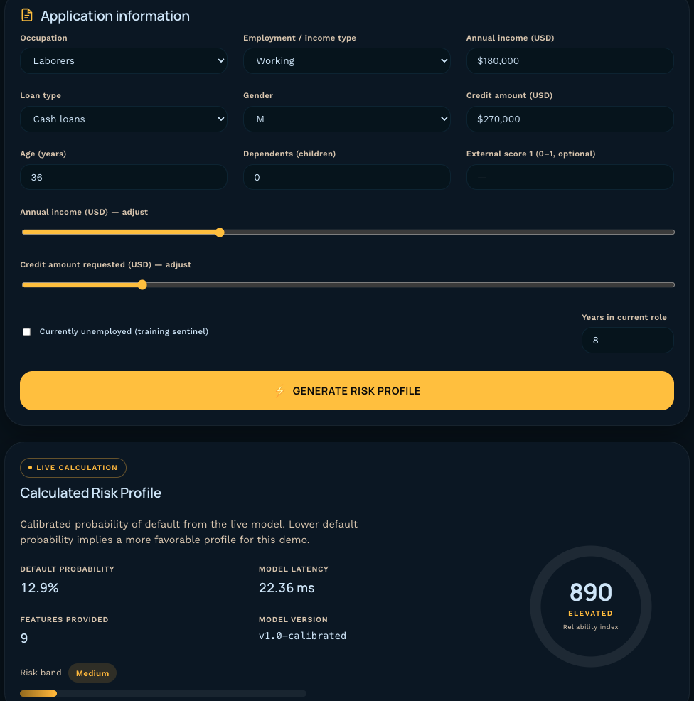

# Credit risk ML 💳

**End-to-end probability-of-default modelling on the [Home Credit Default Risk](https://www.kaggle.com/competitions/home-credit-default-risk/data) dataset — from SQL feature engineering through a calibrated XGBoost pipeline, SHAP explainability, and survival analysis of time-to-delinquency.**

The project is organised as five linked notebooks that together cover the lifecycle of a credit risk model: data understanding, modelling, probability calibration, model explanation, and time-to-event analysis. Training is fully scripted (`src/train.py`) and every run is tracked in MLflow so the numbers in this README regenerate from a single command.

**Live demo:** [**RiskSense — credit risk UI**](https://bdevan5.github.io/credit-risk-ml/) — interactive SvelteKit app on **GitHub Pages** that calls the calibrated **`/predict`** API on **Google Cloud Run**. Ensure Cloud Run’s `ALLOWED_ORIGINS` includes `https://bdevan5.github.io` (see [Scoring API](#scoring-api)).

---

## Headline results


| Metric (test holdout)   | Uncalibrated | Isotonic calibrated |
| ----------------------- | ------------ | ------------------- |
| **ROC-AUC**             | **0.7898**   | 0.7891              |
| **Gini** (2·AUC − 1)    | **0.5796**   | —                   |
| PR-AUC (avg. precision) | 0.2904       | —                   |
| KS statistic            | 0.4418       | —                   |
| Brier score             | 0.1709       | **0.0655**          |


- **Gradient boosting beats a tuned linear baseline by ~1.5 pp AUC** (logistic regression 0.774 → XGBoost 0.789 in the exploration notebook; 0.7898 in the tuned `src/train.py` run).
- **Isotonic calibration cuts Brier score by 62%** (0.17 → 0.07) with negligible AUC cost, making the output suitable for threshold-based policy decisions, not just ranking.
- **5-fold stratified CV** confirms XGBoost and LightGBM are statistically tied at this feature set (AUC 0.786 ± 0.004 for both), so the choice of champion is driven by tooling and calibration support rather than accuracy.

---

## What the project covers


| #   | Notebook                                                       | Focus                                                   | Techniques                                                                                                        |
| --- | -------------------------------------------------------------- | ------------------------------------------------------- | ----------------------------------------------------------------------------------------------------------------- |
| 1   | `[01_eda.ipynb](notebooks/01_eda.ipynb)`                       | **Exploratory analysis** across five business questions | Wilson CIs, concentration (Lorenz-style) curves, heatmaps, stratified defaults                                    |
| 2   | `[02_modelling.ipynb](notebooks/02_modelling.ipynb)`           | **Benchmark + production modelling**                    | sklearn `Pipeline` + `ColumnTransformer`, logistic / XGBoost / LightGBM, stratified K-fold CV, MLflow logging     |
| 3   | `[03_calibration.ipynb](notebooks/03_calibration.ipynb)`       | **Probability calibration for policy use**              | Reliability diagrams, Platt vs isotonic, Brier, ECE, cost-based thresholding, fairness (AUC by occupation)        |
| 4   | `[04_explainability.ipynb](notebooks/04_explainability.ipynb)` | **Global and local model explanation**                  | SHAP `TreeExplainer`, beeswarm and waterfall plots                                                                |
| 5   | `[05_survival.ipynb](notebooks/05_survival.ipynb)`             | **Time-to-delinquency modelling**                       | Kaplan–Meier by risk quartile, multivariate log-rank, Cox PH with Schoenfeld-residual proportional-hazards checks |


Feature engineering lives in `**sql/features/`** (seven files aggregating the full Home Credit schema: application, bureau, bureau balance, credit card balance, POS/cash balance, previous applications, instalments). The EDA layer lives in `**sql/eda/**` (16 parameterised queries — index at `[sql/eda/README.md](sql/eda/README.md)`). The Python package in `**src/**` exposes `build_feature_matrix`, a metrics module (Gini / KS / PR-AUC alongside ROC-AUC), and MLflow helpers.

---

## EDA highlights

Each section in `[notebooks/01_eda.ipynb](notebooks/01_eda.ipynb)` asks one business question, plots against a portfolio-baseline default rate of **8.1%**, and reports quantified findings:

- **Occupation.** Default risk spans **~3.5×** — Low-skill Laborers default at **17.2%** vs Accountants at **4.8%**. The four riskiest roles are ~9% of applicants but ~13% of defaults (concentration curve).
- **Payment burden** (annuity / income). Default rises from **7.05%** (decile 1) to **8.86%** (decile 8) — only a ~1.8 pp swing, with a notable reversal at decile 10. Signal is real but weak standalone.
- **Income × credit (leverage).** Default rate grid ranges from **4.5%** (high income × large credit) to **11.9%** (low income × low credit) — a ~2.6× spread, with low-income rows above baseline across almost every credit decile.
- **Bureau depth and external scores.** Thin-file applicants default at **10.1%** vs **7.7%** for those with history. Normalised `EXT_SOURCE_*` scores are the single strongest signal — defaulters average **0.39–0.41** vs **0.51–0.52** (~0.11 gap on a 0–1 scale).
- **Age.** Monotonic — default falls from **12.3%** for under-25s to **4.9%** for 60+ (~2.5× spread). Every band above 40 sits below baseline.

---

## Modelling

`[notebooks/02_modelling.ipynb](notebooks/02_modelling.ipynb)` benchmarks **logistic regression**, **XGBoost**, and **LightGBM** on one feature set (MLflow experiment `credit-risk-modelling`), runs 5-fold stratified CV on the two gradient-boosted models, and produces a side-by-side comparison table. Logistic regression is dropped from the CV (too slow under dense one-hot encoding and already ~1.5 pp AUC behind the tree models) after the single-holdout comparison.

The **production training run** — tuned XGBoost with `n_estimators=2000, max_depth=4, learning_rate=0.02, reg_lambda=2.0, subsample=0.75` — lives in `src/train.py` and is what the metrics below refer to.


*Auto-generated from MLflow — refresh: `uv run python scripts/sync_readme_from_mlflow.py*`

**MLflow run** `0c13f97febe74095af4a28fe7e742084` — **xgb_2000_depth4_sub075_lambda2**


| Metric                     | Test   |
| -------------------------- | ------ |
| ROC-AUC                    | 0.7907 |
| Gini (2×AUC − 1)           | 0.5814 |
| Average precision (PR-AUC) | 0.2911 |
| KS statistic               | 0.4461 |
| Accuracy                   | 0.7484 |


ROC and precision–recall (test holdout, same split as training)


---

## Calibration and explainability

For credit and capital use cases, **calibrated probabilities** matter: a reported 10% default risk should match the long-run default rate among similarly scored accounts, not merely rank applicants. `[notebooks/03_calibration.ipynb](notebooks/03_calibration.ipynb)` compares **Platt** and **isotonic** `CalibratedClassifierCV`, reports Brier score and expected calibration error (ECE), ties thresholds to a simple **business-cost** matrix, and includes a fairness check (AUC by occupation).

`[notebooks/04_explainability.ipynb](notebooks/04_explainability.ipynb)` uses SHAP `TreeExplainer` on the preprocessed matrix for global beeswarm plots and per-applicant waterfall explanations.


*Auto-generated from MLflow — same command as the Modelling block.*

**MLflow run** `0c13f97febe74095af4a28fe7e742084` — **xgb_2000_depth4_sub075_lambda2** (isotonic `CalibratedClassifierCV` on a stratified row holdout before booster fit; `calibration_holdout_frac=0.1`).


| Metric                            | Test holdout |
| --------------------------------- | ------------ |
| Brier score (uncalibrated)        | 0.1715       |
| Brier score (isotonic calibrated) | 0.0654       |
| ROC-AUC (uncalibrated)            | 0.7907       |
| ROC-AUC (calibrated proba)        | 0.7901       |


Reliability diagram — mean predicted vs observed default rate (test holdout)


Training (`uv run python -m src.train`) writes `**model/model_uncalibrated.pkl`** (preprocess + `XGBClassifier`) and `**model/model_calibrated.pkl**` (isotonic `CalibratedClassifierCV` wrapping the frozen pipeline), and logs both models plus the raw-vs-calibrated reliability figure to MLflow.

---

## Survival analysis

`[notebooks/05_survival.ipynb](notebooks/05_survival.ipynb)` reframes the problem as **time to serious delinquency** (60-days-late threshold on instalment payments). It builds duration / event labels from `installments_payments`, fits **Kaplan–Meier** curves stratified by XGBoost risk quartile, runs a **multivariate log-rank** test of equality, and fits a **Cox proportional-hazards** model with Schoenfeld-residual checks. The closing section contrasts the binary (origination decision) and survival (servicing / EWI) framings and when each is the right tool.

---

## Quick start

```bash
# 1. Download Home Credit CSVs from Kaggle into ./data/
# 2. Build the DuckDB database (tables: application_train, bureau, bureau_balance, …)
uv run duckdb data/home_credit.db < sql/load.sql

# 3. Train the XGBoost pipeline + calibrator, log to MLflow
uv run python -m src.train

# 4. Open any of the five notebooks
uv run jupyter lab notebooks/
```

MLflow UI (experiments, metrics, artefacts, signatures):

```bash
uv run mlflow ui --backend-store-uri sqlite:///mlflow.db
```

Refresh the Modelling and Calibration blocks in this README (metrics tables + figures) from MLflow:

```bash
uv run python scripts/sync_readme_from_mlflow.py --run-id <MLFLOW_RUN_ID>
```

The script updates `docs/figures/mlflow_eval_curves.png`, `docs/figures/reliability_raw_vs_calibrated.png`, and the two marked `MLFLOW_*_SYNC` blocks in place.

---

## Scoring API

`src/api.py` serves the calibrated pipeline (`model/model_calibrated.pkl`) as a FastAPI endpoint, containerised with `Dockerfile` and deployed to **Google Cloud Run** (europe-west2, London).

**Live endpoint:** `https://credit-risk-api-679457675772.europe-west2.run.app`

**End-to-end deployment:** the **API** runs on **Google Cloud Run** (`gcloud run deploy` from this repo). The **RiskSense** web UI under `frontend/` is built and published to **GitHub Pages** by **GitHub Actions** on every push to `master` ([`.github/workflows/deploy-pages.yml`](.github/workflows/deploy-pages.yml)). In the repo’s **Settings → Secrets and variables → Actions → Variables**, set `PUBLIC_API_URL` and `PUBLIC_API_KEY` so the Pages build can embed the live Cloud Run URL and key (same pattern as local `.env`; see also [`scripts/deployment.md`](scripts/deployment.md)).

### Deploy from a fresh clone

```bash
gcloud run deploy credit-risk-api \
  --source . \
  --platform managed \
  --allow-unauthenticated \
  --memory 1Gi \
  --cpu 1 \
  --min-instances 0 \
  --max-instances 3 \
  --concurrency 20 \
  --timeout 60 \
  --set-env-vars "^@^API_KEY=YOUR_KEY@MODEL_VERSION=v1.0-calibrated@ALLOWED_ORIGINS=https://YOURUSERNAME.github.io,http://localhost:5173"
```

The `^@^` separator lets commas appear inside individual env-var values (needed for `ALLOWED_ORIGINS`). First build takes 2–4 minutes on Cloud Build.

### Example usage

**Locally** (no API key required — auth check is skipped unless `API_KEY` is set):

```bash
uv run uvicorn src.api:app --port 8080
# in another terminal:
curl -s http://localhost:8080/health
# {"status":"ok","model_version":"v1.0-calibrated"}

curl -s -X POST http://localhost:8080/predict \
  -H 'Content-Type: application/json' \
  -d '{"EXT_SOURCE_2": 0.55, "AMT_CREDIT": 600000, "DAYS_EMPLOYED": -1200}'
# {"probability":0.13..., "risk_tier":"Medium", "model_version":"v1.0-calibrated", "n_features_provided":3, "elapsed_ms":9.4}
```

**Against the deployed service** (needs the API key that was passed via `--set-env-vars`):

```bash
export API_URL=https://credit-risk-api-679457675772.europe-west2.run.app
export API_KEY=<your-key>

curl -s $API_URL/health

curl -s -X POST $API_URL/predict \
  -H 'Content-Type: application/json' \
  -H "X-API-Key: $API_KEY" \
  -d '{"EXT_SOURCE_2": 0.55, "AMT_CREDIT": 600000, "DAYS_EMPLOYED": -1200}'
```

Response fields: `probability` (calibrated, in [0, 1]), `risk_tier` (Low/Medium/High), `model_version`, `n_features_provided`, `elapsed_ms` (server-side predict latency). Any column from the 224-feature training schema may be supplied; omitted fields are imputed.

---

## Repository layout

```
credit-risk-ml/
├── .github/workflows/     # e.g. deploy-pages.yml — GitHub Pages CI for frontend/
├── frontend/              # SvelteKit UI (GitHub Pages) → Cloud Run /predict
├── notebooks/             # 01_eda, 02_modelling, 03_calibration, 04_explainability, 05_survival
├── sql/
│   ├── load.sql           # CSV → DuckDB loader
│   ├── eda/               # 16 parameterised EDA queries (indexed in eda/README.md)
│   └── features/          # 7 feature-engineering queries, one per source table
├── src/
│   ├── features.py        # build_feature_matrix() — full join + aggregation pipeline
│   ├── train.py           # XGBoost pipeline, isotonic calibration, MLflow logging
│   ├── metrics.py         # ROC-AUC, Gini, KS, PR-AUC, ROC/PR plot helpers
│   ├── mlflow_helpers.py
│   └── api.py             # FastAPI app — /health and /predict over the calibrated pipeline
├── Dockerfile             # Production container (uv sync --no-dev; ~500 MB image)
├── .dockerignore
├── docs/figures/          # Figures embedded in this README (MLflow-synced)
├── model/                 # Trained artefacts (gitignored; model_calibrated.pkl shipped into the container)
└── mlflow.db              # SQLite MLflow backend - not git-committed
```

---

## Future work 🔮

- **Richer explanations in the UI.** The [live demo](https://bdevan5.github.io/credit-risk-ml/) already surfaces calibrated probability and risk tier from Cloud Run; next steps include a **SHAP waterfall** (or similar) driven by a dedicated **`/explain`** endpoint and per-request feature attributions.
- **Known limitations.** The current evaluation is a stratified row split rather than a time-based holdout, so calibration stability over time is untested; the model is trained only on approved applicants and inherits that selection bias; and there is no drift monitoring or champion-challenger tooling around the trained artefact.

---

## Live demo (screenshot)

The RiskSense UI on GitHub Pages: application intake, scores from the Cloud Run API, and browser-local simulation history.



---

## Stack

Python 3.12 · uv · DuckDB · pandas · scikit-learn · XGBoost · LightGBM · SHAP · lifelines · MLflow (SQLite backend) · matplotlib · FastAPI · Docker · **Google Cloud Run** · SvelteKit · **GitHub Actions** · **GitHub Pages**.