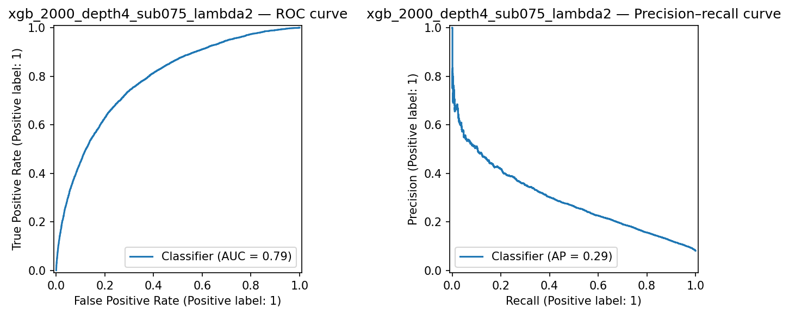
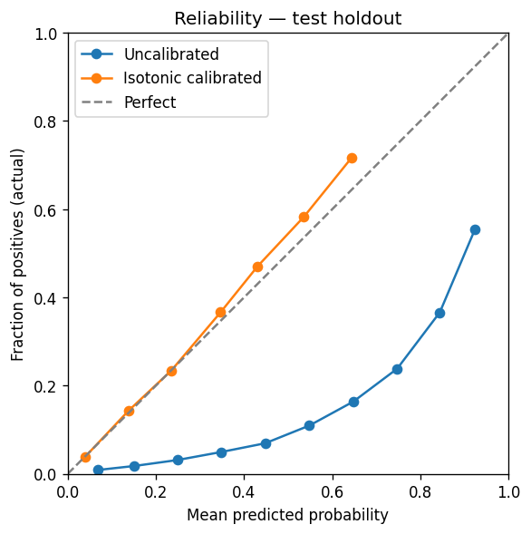

# Credit risk ML 💳

## Intro

The aim of this project is to **model the probability of loan default** using application and bureau data, then **compare alternative feature sets and modeling choices** (e.g. baselines vs richer pipelines, validation discipline) so decisions are evidence-based. Longer term, the intent is to **move from experiments toward a production-grade pipeline**: reproducible data loading, feature builds, training/evaluation, and deployment hooks.

**Getting started with the data:** Download the [Home Credit Default Risk](https://www.kaggle.com/competitions/home-credit-default-risk/data) competition files from Kaggle and place the CSVs under **`data/`**. Run **`sql/load.sql`** against DuckDB to create tables (e.g. `application_train`, `bureau`, …) and materialize **`data/home_credit.db`**. After that you can run SQL under `sql/eda/` or open the EDA notebook, which reads the same database.

## EDA 📊

Exploratory analysis asks how strong applicants’ characteristics are related to **`TARGET`** (default vs not). See the notebook **[`notebooks/01_eda.ipynb`](notebooks/01_eda.ipynb)** for plots and tables (DuckDB → `data/home_credit.db`, queries from `sql/eda/`).

- **Occupation and concentration** — Occupation is a strong predictor of default rate and a simple feature to use with 12 unique values.
- **Payment burden (annuity / income)** — Higher payment burdens lead to higher default rates. Individuals in the lower median of payment burden are less likely to default. The single exception is the 10th decile, where a significant drop is seen from the 9th decile.
- **Income × credit (leverage)** — The safest applicants tend to be on the edges of the credit amount distributions, with the highest risk applicants in the middle. Additionally, the lower the income, the larger the risk-band and the higher the default rate.
- **Bureau depth, thin files, external scores** — More information about applications leads to significantly better predictions. Applicants with no bureau history, or very few lines on record, are more likely to default. Additionally, the available external signals provide signal on default rate.
- **Age bands** — Older applicants are monotonically safer and less likely to default. The high-risk segment is concentrated among younger applicants.

Index of EDA query files and what each returns: **[`sql/eda/README.md`](sql/eda/README.md)**.

## Modelling

Notebook **[`notebooks/02_modelling.ipynb`](notebooks/02_modelling.ipynb)** compares logistic regression, XGBoost, and LightGBM on one feature set (MLflow experiment `credit-risk-modelling`). Scripted training and the same metrics live in **`src/train.py`** (`uv run python -m src.train`).

<!-- MLFLOW_README_SYNC_BEGIN -->

_Auto-generated from MLflow — refresh: `uv run python scripts/sync_readme_from_mlflow.py`_

**MLflow run** `c6598c78fb0b46e18bbfb8707f0c5508` — **xgb_2000_depth4_sub075_lambda2**

| Metric | Test |
| --- | --- |
| ROC-AUC | 0.7898 |
| Gini (2×AUC − 1) | 0.5796 |
| Average precision (PR-AUC) | 0.2904 |
| KS statistic | 0.4418 |
| Accuracy | 0.7483 |



<!-- MLFLOW_README_SYNC_END -->

## Calibration and explainability

For credit and capital use cases, **calibrated probabilities** matter: a reported 10% default risk should match the long-run default rate among similar scored accounts (after binning), not merely rank applicants. **[`notebooks/03_calibration.ipynb`](notebooks/03_calibration.ipynb)** compares calibration methods (reliability diagrams, **Platt** and **isotonic** `CalibratedClassifierCV`, Brier, **ECE**, business-cost thresholding). **[`notebooks/04_explainability.ipynb`](notebooks/04_explainability.ipynb)** has **SHAP** global and local plots.

<!-- MLFLOW_CALIB_README_SYNC_BEGIN -->

_Auto-generated from MLflow — same command as the Modelling block._

**MLflow run** `c6598c78fb0b46e18bbfb8707f0c5508` — **xgb_2000_depth4_sub075_lambda2** (isotonic `CalibratedClassifierCV` on a stratified row holdout before booster fit; `calibration_holdout_frac=0.15`).

| Metric | Test holdout |
| --- | --- |
| Brier score (uncalibrated) | 0.1709 |
| Brier score (isotonic calibrated) | 0.0655 |
| ROC-AUC (uncalibrated) | 0.7898 |
| ROC-AUC (calibrated proba) | 0.7891 |



<!-- MLFLOW_CALIB_README_SYNC_END -->

Training (`uv run python -m src.train`) writes **`model/model_uncalibrated.pkl`** (preprocess + `XGBClassifier`) and **`model/model_calibrated.pkl`** (isotonic `CalibratedClassifierCV` wrapping the frozen pipeline), and logs both models plus a raw-vs-calibrated reliability figure to MLflow.

## Future work 🔮

- Deploy the model to a web service to enable real-time scoring.


## Commands to run the project

Run **`mlflow`** locally to view experiments: `uv run mlflow ui --backend-store-uri sqlite:///mlflow.db`

### Training and README metrics

From the **repository root**, with **`data/home_credit.db`** in place, train the XGBoost pipeline and log a run to **`mlflow.db`** (the script prints the MLflow run id when finished):

```bash
uv run python -m src.train
```
This script internally calls the `build_feature_matrix` function to build the feature matrix and then trains the model.

To **refresh the Modelling and Calibration sections** in this README (metrics tables, ROC/PR figure, Brier/AUC table, reliability diagram) from MLflow, run the sync script. It uses the run id configured in the script unless you override it with `--run-id`:

```bash
uv run python scripts/sync_readme_from_mlflow.py --run-id c6598c78fb0b46e18bbfb8707f0c5508
```

The script updates `docs/figures/mlflow_eval_curves.png`, `docs/figures/reliability_raw_vs_calibrated.png`, and the two marked README blocks.